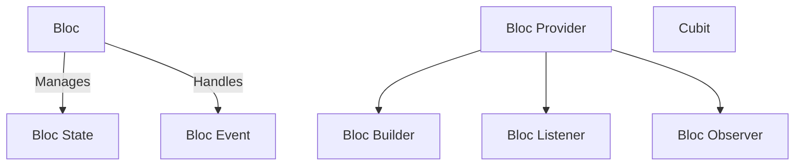

# bloc_lesson

## Topics Included:

## Bloc
Bloc is a state management solution that helps separate business logic from UI in Flutter applications.

### Bloc State
Represents the different states of the application managed by the Bloc.

### Bloc Event
Defines the events that trigger state changes within the Bloc.

## Bloc Provider
Provides a Bloc instance to the widget tree for access by child widgets.

## Bloc Builder
Listens to state changes and rebuilds the UI accordingly.

## Bloc Listener
Executes side effects (like showing a snackbar) in response to state changes.

## Bloc Observer
Monitors all Bloc and Cubit state transitions for debugging and logging purposes.

## Cubit
A simplified version of Bloc that manages state with fewer complexities.
