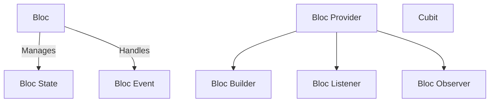

# bloc_lesson

## Topics Included:

```mermaid
graph TD;
    A[Bloc] -->|Manages| B[Bloc State];
    A -->|Handles| C[Bloc Event];
    D[Bloc Provider] --> E[Bloc Builder];
    D --> F[Bloc Listener];
    D --> G[Bloc Observer];
    H[Cubit];
```

## Bloc
- Bloc State
- Bloc Event

## Bloc Provider
## Bloc Builder
## Bloc Listener
## Bloc Observer
## Cubit
